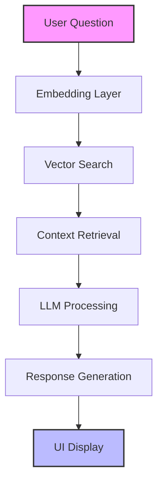

# 🏘️ Real Estate Architect Assistant

[](https://www.python.org/)
[](https://streamlit.io/)
[](https://www.trychroma.com/)
[](https://groq.com/)

A powerful **Retrieval-Augmented Generation (RAG)** application that helps users understand real estate regulations, architecture norms, and design principles. Built with modern AI technologies for accurate, context-aware responses.

## 🌟 Features

- 🤖 **Smart Responses**: Powered by Groq's Mistral API
- 📚 **Rich Knowledge Base**: Includes building codes, zoning laws, and design guidelines
- 🔍 **Semantic Search**: Using sentence-transformers for accurate context retrieval
- 💾 **Persistent Storage**: Local ChromaDB for reliable vector storage
- 🎨 **Modern UI**: Built with Streamlit for a seamless user experience

## 🔧 Tech Stack

<details>
<summary>Click to expand</summary>

| Component    | Technology                      | Description                               |
|-------------|----------------------------------|-------------------------------------------|
| Embedding   | `sentence-transformers (MiniLM)` | Converts text to semantic vectors         |
| Vector Store| `ChromaDB`                       | Local, persistent vector database         |
| LLM         | `Groq (llama-3.1-8b-instant)`   | Fast, accurate language model            |
| Frontend    | `Streamlit`                      | Interactive web interface                 |
| UI Extras   | `streamlit-extras`              | Enhanced UI components                    |

</details>

## 🧠 System Architecture



## 📁 Project Structure

<details>
<summary>Click to see project layout</summary>

```plaintext
rag-architect-app/
├── data/
│   ├── raw/                   # Source documents
│   └── processed/
│       ├── clean_text/        # Processed architecture docs
│       └── property_chunks/   # Property listings data
│
├── vector_db/
│   ├── chroma_store/         # ChromaDB storage
│   └── store_to_chroma.py    # Database operations
│
├── scripts/
│   ├── ScrapData/           # Data collection scripts
│   └── preprocess.py        # Document processing
│
├── front_end/
│   └── app.py               # Streamlit application
│
├── requirements.txt         # Dependencies
└── README.md               # Documentation
```

</details>

## 🚀 Quick Start

<details>
<summary>1. Clone and Setup</summary>

```bash
# Clone the repository
git clone https://github.com/your-username/rag-architect-app.git
cd rag-architect-app

# Create and activate virtual environment
python -m venv v
v\Scripts\activate  # Windows
source v/bin/activate  # Linux/Mac
```

</details>

<details>
<summary>2. Install Dependencies</summary>

```bash
# Install required packages
pip install -r requirements.txt
```

</details>

<details>
<summary>3. Configure Environment</summary>

```bash
# Create .env file and add your Groq API key
echo "GROQ_API_KEY=your_groq_api_key" > .env
```

</details>

<details>
<summary>4. Process Data and Start App</summary>

```bash
# Process documents
python scripts/preprocess.py

# Store in ChromaDB
python vector_db/store_to_chroma.py

# Launch the application
streamlit run front_end/app.py
```

</details>

## 📝 Usage

1. Open your browser and navigate to `http://localhost:8501`
2. Enter your architecture or real estate related question
3. Get AI-powered responses with relevant citations

## 🤝 Contributing

Contributions are welcome! Please feel free to submit a Pull Request.

## 📄 License

This project is licensed under the MIT License - see the LICENSE file for details.

---

<div align="center">
Made with ❤️ for the architecture community
</div> 